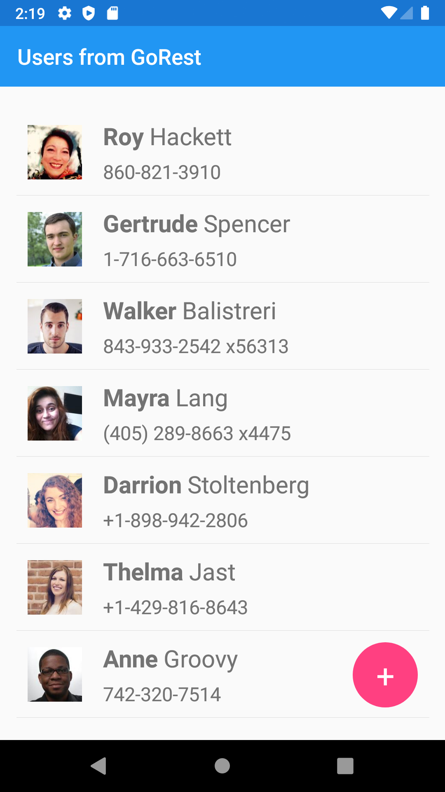
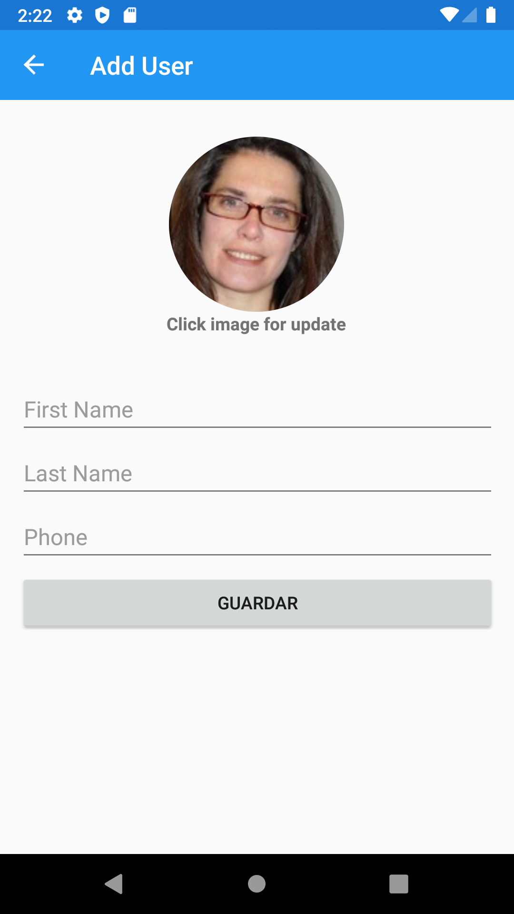
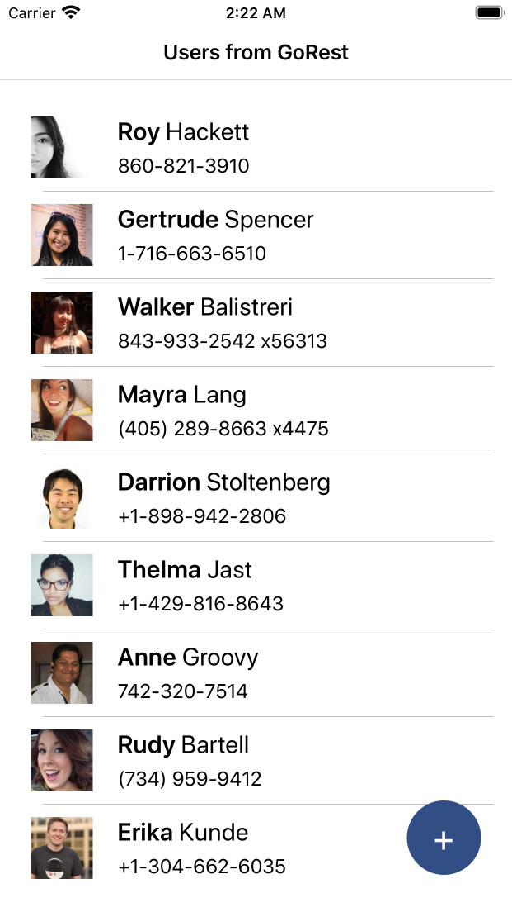
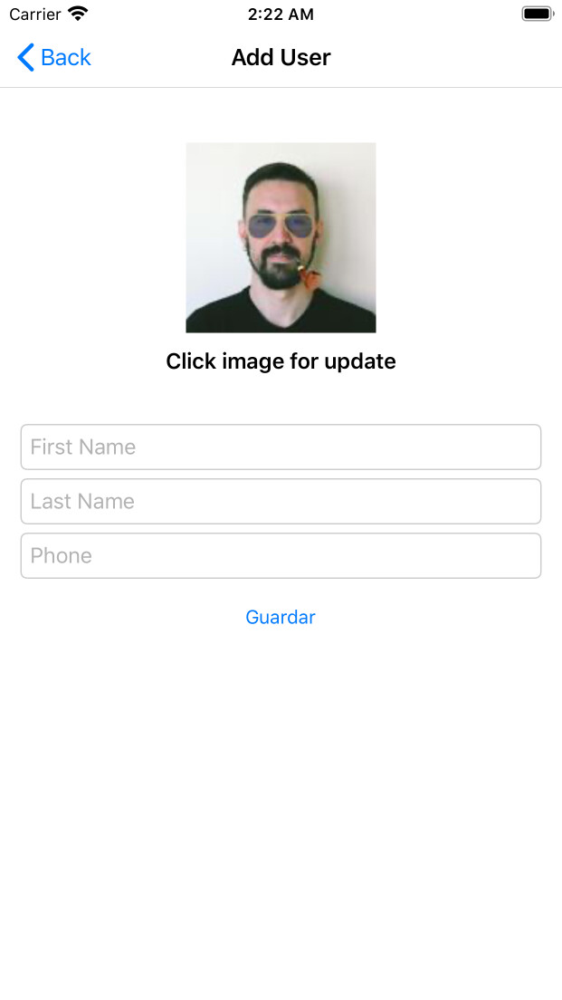

# Technical exam - Advanced Software - Xamarin
## Original sentence (Spanish)

#### 1.- Aplicación Xamarin:
* Crear una aplicación desarrollada en Xamarin .
* La aplicación debe mostrar un listado de usuarios que deben ser consumidos desde el siguiente end-pint: https://gorest.co.in/public-api/users?_format=json&access-token=Ox6Q2-n0_oykltSxxS33Imom38WwXCJyHXAc
Si la api no está disponible buscar alguna similar.
*	Mostrar en el listado una imagen de usuario, el nombre y apellido y el teléfono.
*	Crear un formulario para agregar usuarios en memoria. Al cerrar y volver a iniciar la app no deben mostrarse. Los campos del usuario deben ser los mismos que se muestran en el listado.
*	El acceso al formulario de creación de usuario debe ser a través del clásico botón de “+” flotante.
#### 2.- Requerimientos técnicos:
*	Crear la app para las últimas dos versiones de Android.
*	Crear la app para las últimas dos versiones de IOS.
#### 3.- Entregables:
*	Código del proyecto de Xamarin.
*	Aplicación Android.
*	Aplicación IOS.

## Topics used in this project
* Xamarin.Forms
* MVVM
  * INotifyPropertyChanged
  * ICommand
  * EventArgs
  * Converters
  * DataBindindig
  * ResourceDictionary
* Consume WebApi
  * GoRest
    - https://gorest.co.in/public-api/users?_format=json&access-token={AppSettings.TokenGorest}
  * RandomUser
    - https://randomuser.me/api/?inc=picture
* HttpClient
* Newtonsoft.Json

## Screenshot of iOS and Android application
#### List of users on Android

#### Add user on Android

#### List of uses on iOS

#### Add user on iOS

